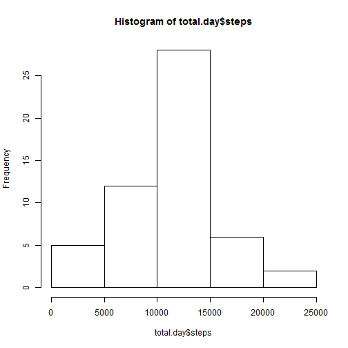
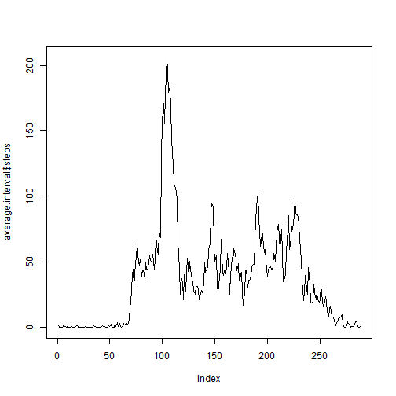
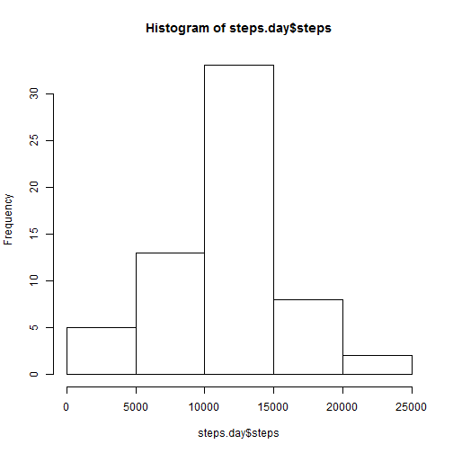

## Loading and preprocessing the data

Reading data

```r
data <- read.csv(unz("activity.zip", "activity.csv"))
```


```r
head(data)
```

```
##   steps       date interval
## 1    NA 2012-10-01        0
## 2    NA 2012-10-01        5
## 3    NA 2012-10-01       10
## 4    NA 2012-10-01       15
## 5    NA 2012-10-01       20
## 6    NA 2012-10-01       25
```

```r
tail(data)
```

```
##       steps       date interval
## 17563    NA 2012-11-30     2330
## 17564    NA 2012-11-30     2335
## 17565    NA 2012-11-30     2340
## 17566    NA 2012-11-30     2345
## 17567    NA 2012-11-30     2350
## 17568    NA 2012-11-30     2355
```

## What is mean total number of steps taken per day?

Average of each day

```r
average.day <- aggregate(steps~date, data=data, mean)
```

Total number of steps taken each day

```r
total.day <- aggregate(steps~date, data=data, sum)
```

Histogram of the total number of steps taken each day

```r
hist(total.day$steps)
```

 

Mean and median total number of steps taken per day

```r
mean(total.day$steps, na.rm=T)
```

```
## [1] 10766.19
```

```r
median(total.day$steps, na.rm=T)
```

```
## [1] 10765
```

## What is the average daily activity pattern?

Time series plot of the 5-minute interval and the average number of steps taken

```r
average.interval <- aggregate(steps~interval, data=data, mean)
```


```r
plot(average.interval$steps, type="l")
```

 

Which 5-minute interval, on average across all the days in the dataset, contains the maximum number of steps?

```r
which.max(average.interval$steps)
```

```
## [1] 104
```

## Imputing missing values

Calculate and report the total number of missing values in the dataset (i.e. the total number of rows with NAs)

```r
sapply(data, function(x) sum(is.na(x)))
```

```
##    steps     date interval 
##     2304        0        0
```

For missing values I use *Multiple Imputation*.
Missing values are filled in based on non-missing values.
I use Multiple Imputation by Chained Equations (mice) package.

Install and load mice package

```r
library(mice)
```

```
## Warning: package 'mice' was built under R version 3.1.2
```

```
## Loading required package: Rcpp
## Loading required package: lattice
## mice 2.22 2014-06-10
```

Perform Multiple Imputation. Create a new dataset that is equal to the original dataset but with the missing data filled in

```r
set.seed(144)
imputed = complete(mice(data))
```

```
## 
##  iter imp variable
##   1   1  steps
##   1   2  steps
##   1   3  steps
##   1   4  steps
##   1   5  steps
##   2   1  steps
##   2   2  steps
##   2   3  steps
##   2   4  steps
##   2   5  steps
##   3   1  steps
##   3   2  steps
##   3   3  steps
##   3   4  steps
##   3   5  steps
##   4   1  steps
##   4   2  steps
##   4   3  steps
##   4   4  steps
##   4   5  steps
##   5   1  steps
##   5   2  steps
##   5   3  steps
##   5   4  steps
##   5   5  steps
```

Make a histogram of the total number of steps taken each day 

```r
steps.day <- aggregate(steps~date, data=imputed, sum)
```


```r
hist(steps.day$steps)
```

 

Calculate and report the mean and median total number of steps taken per day

```r
mean(steps.day$steps)
```

```
## [1] 11124.85
```

```r
median(steps.day$steps)
```

```
## [1] 11352
```

The impact of imputing missing data on the estimates of the total daily number of steps is that the mean and median are higher with imputation than without it

## Are there differences in activity patterns between weekdays and weekends?

Transform factor variable date in a *date format*  

```r
date.format <- as.Date(steps.day$date)
```

Getting names of the days

```r
days.name <- weekdays(date.format)
```

Index of weekends

```r
indx.weekend <- days.name == "Sunday" | days.name == "Saturday" 
```

Steps mean of weekends

```r
mean(steps.day$steps[indx.weekend]) 
```

```
## [1] 12336.25
```

Steps mean of no weekends days

```r
mean(steps.day$steps[-indx.weekend]) 
```

```
## [1] 11045.55
```

According to these results it seems the number of steps during weekends is higher.


